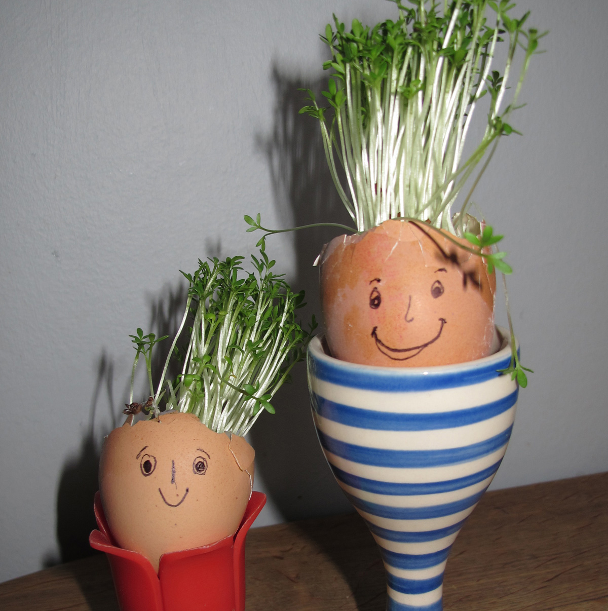
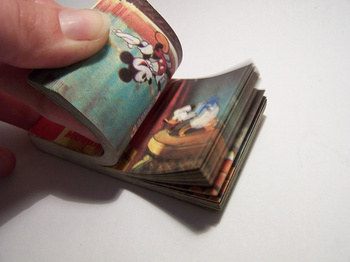
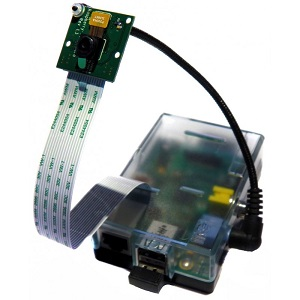

# Cress Egg Heads

A fun time-lapse photography project with the Raspberry Pi Camera Board and cress seed



## Lesson objectives

- Understand what time lapse photography is
- Understand how cress seeds germinate and grow
- Understand how to make a time lapse film

## Lesson outcomes

- To have grown some cress from seeds
- To have made one or more cress egg heads
- To have recorded a time lapse film of them growing over a period of 1 week
- To play back the time lapse film and see the cress growing rapidly

## Time

- 1-2 hour initially for setting up
- Further attendance spread over 1 week (or so) as the cress grows
- 1 hour to wrap up

## Requirements

- An area with sunlight that can be left undisturbed for long periods of time
- Eggs
- Saucepan to boil the eggs in
- Egg cup holders
- Cotton wool
- Washing up liquid and bowl
- Pencils or crayons
- Kitchen roll
- Flip book (if possible, can be about anything)
- Dinner knife
- Teaspoon
- Plate
- Plastic spray bottle with trigger
- Packet of cress seeds (£1.55 from B&Q)
- Raspberry Pi
- Micro USB power adaptor
- An SD card with Raspbian already set up through NOOBS
- USB keyboard
- HDMI cable
- A monitor or TV
- Raspberry Pi Camera Board
- Camera Board 360 Gooseneck Mount (from [modmypi.com](https://www.modmypi.com/flexible-camera-mount "ModMyPi | RPi Camera Board 360 Gooseneck Mount"))

##Introduction

Ideally, begin with a discussion of how plants germinate from seeds and how they require the correct conditions in order to start growing, such as moisture and the correct temperature.

Next, discuss the speed at which plants grow.  They grow far too slowly for us to see it happening.  However, there is a trick that we can use to speed up time and see it!



A useful prop to bring out now is a flip book.  A flip book contains a series of pictures that change gradually from one page to the next.  When the pages are turned rapidly, the picture appears to move.  This is the fundamental principle behind all TV cartoons and film footage.

Explain that if we were to capture images of the same landscape every hour for a day, we would end up with 24 pictures.  If we were to play back (flip through) those images at normal film speed, it will appear that time is moving very fast.  We would see the sun rise, move through the sky and set in just a few moments.  This is what we call a time lapse film.

Wrap up by explaining that if we make cress egg heads, we can use the technique of time lapse photography to speed up time see the hair (cress) appearing to grow.  The only trouble is we need to let the time elapse and capture the images along the way.  This is where the Raspberry Pi comes in.  But first we'll need to make some cress egg heads!

##Step 1: Making a cress egg head

Begin by soft boiling the egg in a saucepan.  Take care to avoid splashing hot water and burning yourself.  Boil for no more than 3 minutes.  Remove the egg using the spoon and allow to cool before handling.

Remove the top of the egg with the knife, as you would if you were going to eat it.  Take care to avoid cracking the remaining shell of the egg.

Use the spoon to scoop out all of the cooked egg from the inside of the eggshell.  Your aim is to have a completely empty shell; don’t worry if you spill some yolk on the outside.

Use the washing up liquid and bowl to wash the eggshell inside and out.  Just use your fingers and handle the shell with care to avoid cracking it.  Make sure there is no dried yolk on the outside.

Leave the egg to dry on some kitchen roll.

Once the egg has dried you can use the crayons and pencils to carefully decorate it.  Remember that the hole will be facing upwards, so bear this in mind if you want to draw a face.

Fill the eggs to the top with cotton wool and dampen with water.  Top up with extra cotton wool and dampen again if necessary.  The cotton wool should reach the top of the hole in the eggshell.


Place the egg into an egg cup, then place the egg cup onto a plate.

Use your finger and thumb to sprinkle some cress seeds onto the cotton wool; the plate will catch any excess.  That’s it; the egg head is now ready to grow.  Place the egg cup in a place where it will receive sunlight during the day.

## Step 2: Setting Up your Pi

First check that you have all the parts you need to get your Raspberry Pi set up and working.

- Raspberry Pi
- Micro USB power adaptor
- An SD card with Raspbian already set up through NOOBS
- USB keyboard
- HDMI cable
- A monitor or TV

### Activity Checklist

1.	Place the SD card into the slot of your Raspberry Pi. It will only fit one way so be careful not to break the card.
2.	Next connect the HDMI cable from the monitor (or TV) to the HDMI port on the Pi and turn on your monitor.
3.	Plug a USB keyboard into a USB slot on the Pi.
4.	Plug in the micro USB power supply and you should see some text appear on your screen.
5.	When prompted to login type:

	```
	Login: pi
	Password: raspberry
	```

##Step 3: Setting up the Camera Board

Follow the official instructions [here](http://www.raspberrypi.org/camera "Camera | Raspberry Pi") to set up and test the Raspberry Pi Camera Board.  Stop once you have successfully used a few of the example commands.

Next set up the 360 Gooseneck Mount.  This will allow you to aim the camera at the cress egg heads and hold it steady for the duration of the time lapse recording.



One end of the mount inserts into the headphone jack on the Pi; it only uses this to hold itself in place and does nothing to the jack. The other end is a screw with a pair of plastic washers that secure the camera board to the Gooseneck.

After you have logged into the Raspberry Pi again, you can take a still image using the following command:

`raspistill –o test.jpg –t 5000`

This will take a still image and save it to a file called `test.jpg` after a five second delay.  The `–o` means output and the `–t` means time.  Here we’re specifying 5000 milliseconds or 5 seconds.

If you now use the `ls` command you’ll see the file `test.jpg` is shown in the list.  It would obviously be too time-consuming to sit in front of the Raspberry Pi for a whole week running this command every hour.  Fortunately, there is a way to automate this process which will allow the Raspberry Pi to record the time lapse film completely unattended.

##Step 4: Recording a short time lapse test run

It’s a good idea to perform a dry run first, as this will familiarise you with the process before attempting a longer time lapse.  You can discard the images afterwards.  The command below will automatically capture an image every 10 seconds for 10 minutes. Time must be specified in milliseconds, so 10 seconds is 10000 and ten minutes is 600000.

`raspistill –o test_%04d.jpg –tl 10000 –t 600000`

The `–o` specifies the output as before, the `–tl` is the interval to take pictures at and `–t` is the total recording time.  The `%04d` will add a four digit sequential number at the end of each filename.

`test_0001.jpg` `test_0002.jpg` ...

Avoid moving the camera for best results; even a tiny movement will look like a huge jolt when you play back the final time lapse film.  While the time lapse is recording you will see the camera preview window, with periodic flashes of the still images as they are taken.  Allow the ten minutes to elapse; the camera preview will then stop and you’ll be returned to the command prompt.

Use the `ls` command again and you should see roughly 60 images have been created.  Now run `ls -lh`.  This will list the files with their sizes in human readable format.  Look just to the left of the date on each row.  The sizes will probably range between 2 and 3 MB.


Let’s take this test run all the way to the end.  Next we need to stitch the 60 or so images together to form a film file that can be played back.  There are a set of tools called avconv (audio video convert) that we can use for this.

Use the following command to install avconv.  You only need to do this once.

`sudo apt-get install libav-tools`

This will ask to download about 20 MB of data; say yes and allow the install to proceed.  It will take several minutes.  Once complete, you can use the command below to construct the video file from the individual images.  Enter it all on one line.

```
avconv –r 10 –i test_%04d.jpg –r 10
–vcodec libx264 –crf 20 -g 15
test_timelapse.mp4
```

This will make a video at the same resolution as the individual images (2592 x 1944 pixels).  You’ll notice it's quite slow on the Raspberry Pi.  Press `Ctrl – C` to abort the encoding process.  You can speed this up by scaling down each image as they’re stitched into the final film; the command below will do just that.

```
avconv –r 10 –i test_%04d.jpg –r 10
–vcodec libx264 –crf 20 -g 15
-vf scale=1296:972 test_timelapse.mp4
```

The `–r` specifies the video frame rate. Here we’re using 10 frames a second; this is adequate for a time lapse film.  It’s used twice to avoid avconv dropping similar looking frames.  The `–i` is the input filename; notice the `%04d` from before.  The `–vcodec` specifies the codec (encode/decode) format of the video you’re making. We've specified H264; YouTube uses this codec for streaming.  The `–crf` specifies the compression quality level.  20 is an average value; lower numbers give higher quality but also increase file size.  The `–g` specifies the GOP value; this is needed if you upload the video to YouTube later.  Finally, the `–vf` specifies a video filter that scales the images down to the given height and width.  Scale values can be tweaked as necessary.

Once the encoding process has finished you’ll be returned to the command prompt.  It may take a while to finish so be patient; maybe it’s time for a cup of tea.  When the process has completed you can use the command below to play back the film on the Raspberry Pi.

`omxplayer test_timelapse.mp4 –o hdmi`

Please note that it is much faster to do the encoding on a desktop PC or Mac.  Visit [this page](http://libav.org/download.html "Get Libav") to download the appropriate version for your operating system.

If you want to delete all the files from this test run then use the following command:

`rm test_*.*`

##Step 5: Start recording the main time lapse film

Before you start time lapse recording the cress egg heads there are several things you should consider.  The most important is the physical location where the recording will take place.  This needs to be somewhere warm with sunlight that can be left *undisturbed* for a whole week; a classroom windowsill might not be ideal.  Even slight movements will be noticeable in the final cut.

A power failure will break the sequence of file numbering so you should try to prevent any loss of power after the recording starts.  If this does happen you’ll need to start again.

Having a man-made light source on the cress egg heads will allow growth to be recorded at night, and will make for a nicer end result.  Without this setup, the recording will switch abruptly between light and darkness.

You may also wish to have a network cable plugged in, so that you can log into the Pi remotely and monitor that the file creation process is continuing as expected (read up about SSH).

Space on the SD card should also be taken into consideration.  If you run out of free space half way through the week some footage will be lost.  This can be predicted with a simple calculation to ensure there is enough free space on the SD card before starting.

Let’s check this first.  On average, an image will be about 3 MB in size. There are 24 hours in a day so if we record one image per hour, the space needed is 3 MB x 24 = 72 MB a day.  In a week we will need 72 MB x 7 = 504 MB.  504 MB!  So if we ensure we have at least 1000 MB (1 GB) free on the SD card we should be fine.

You can use the following command to check how much free space you have:

`df -h`

This should show you something like the text below.  Look at the size value for rootfs under the available space column (Avail).  In the example below it shows 2 GB is free.

```
Filesystem      Size  Used Avail Use% Mounted on
rootfs          3.6G  1.5G  2.0G  43% /
/dev/root       3.6G  1.5G  2.0G  43% /
devtmpfs        101M     0  101M   0% /dev
tmpfs            22M  232K   22M   2% /run
tmpfs           5.0M     0  5.0M   0% /run/lock
tmpfs            44M     0   44M   0% /run/shm
/dev/mmcblk0p1   56M   19M   38M  34% /boot
```
If it looks like you don’t have enough space you can use an SD card with a larger capacity.

Once you have identified a suitable filming location, set up the Raspberry Pi, Camera Board, Gooseneck mount, keyboard, monitor and cress egg heads there.  Boot up the Raspberry Pi, log in as normal and use the camera preview command to get everything positioned correctly:

`raspivid –t 0`

If there are multiple cress egg heads, try to get them all in the shot.  Remember that still images will appear a little more zoomed out than the camera preview.  Once you’re satisfied with the position of the camera and egg heads, you can press `Ctrl – C` to stop the preview.

Now you’re ready to start the time lapse recording.  Firstly, we need to work out the interval time and total time in milliseconds to give to the raspistill command.  One hour is 1000 * 60 * 60 = 3600000.  One day is 3600000 * 24 = 86400000.  One week is 86400000 * 7 = 604800000.  Therefore our final command should be this:

`raspistill –o cress_%04d.jpg –tl 3600000 –t 604800000`

The first image will only be captured after the first hour, so you still have one hour to make any final adjustments and disconnect the keyboard and monitor.  For extra reliability you could secure the Pi and Gooseneck mount in place with some tape.  Write down the exact time you start the time lapse; you’ll want to know this at the end of the week.

Disconnect the keyboard first and with one final check of the camera preview, remove the monitor cable from the Raspberry Pi without moving anything.  *Setup is now complete*.  **It should be left undisturbed for 7 days**.  A quick visual check that everything is still okay is the red LED on the camera board.  If the LED goes off, either the time lapse recording has finished after 7 days of elapsed time, or the recording has been interrupted by a problem such as loss of power. Occasional checks of the LED are recommended.

##Step 6: Letting the cress grow and looking after it

The main priority now is to avoid touching or moving anything to ensure the final time lapse film will look good.

*Check the cress egg heads at least once a day (preferably more) to ensure the cotton wool does not dry out.*

Use the plastic spray bottle to top up the moisture as necessary; it should be damp but not soaking.  Often a single spray per eggshell is enough.

If the room you have chosen is too cold you may see mould developing, which may mean you’ll have to start again.  Remember the seeds need warmth, light and water.

If the time lapse is being recorded on school premises, it can be nice to select one pupil per day to join the teacher for watering the cress.  This extends the sense of investment the pupils have in the project beyond just making the cress egg heads at the start.  This may also motivate them to work hard and behave in other classes so that they are chosen for this task.

When the cress starts to grow it may lean towards the direction of the sunlight; this is normal.  This can be mitigated to a certain extent by rotating the egg cups to face the opposite way; however this will be noticeable in the final time lapse film.

##Step 7: Creating the time lapse film file

The cress should be gaining some height by the end of the week.  Wait for the red LED on the camera board to go out before retrieving the images.  This should happen exactly one week, to the minute, after you started the time lapse.

Reconnect the monitor and keyboard and use the ls command.  You should find that about 170 images have been created.  These files must be preserved carefully; it’s a good idea to back them up onto a USB flash drive.  If you want to move the Raspberry Pi back to the classroom before encoding the time lapse video, ensure you shut the Pi down using the `sudo halt` command.  This will shut down the Pi safely and cleanly; it is generally advisable to wait for the *ACT* (activity) LED to stop blinking on the Pi before removing the power cable.

Remember that producing the final time lapse film will be much quicker on a modern desktop PC.  The Pi can perform the task but it will require more time for processing the film.

The image files will always remain however many times you encode the film file, so the final time lapse film can be rebuilt as many times as is necessary. One approach might be to try different video filter scales or frame rates on each attempt.  Refer to the test run section if you need a reminder of what the different parts of the avconv command mean.  If encoding on the Raspberry Pi, it is recommended to first build the video with a scale video filter as in the command below;  as before, enter the entire command on one line.

```
avconv –r 10 –i cress_%04d.jpg –r 10
–vcodec libx264 –crf 20 -g 15
-vf scale=1296:972 cress_timelapse.mp4
```

This will take longer than the test run to finish as there are more frames to encode.  When you are returned to the command prompt you can play back the film using the following command:

`omxplayer cress_timelapse.mp4 –o hdmi`

If you’re happy with the way it looks, you could then rebuild the film at full resolution by leaving out the video filter part of the command.  This will take a lot longer on the Pi, but the end product will look better if uploaded to social media.  Here is the command:

```
avconv –r 10 –i cress_%04d.jpg –r 10
–vcodec libx264 –crf 20 -g 15
cress_timelapse_full.mp4
```

Once complete the full video can be played back using the following command:

`omxplayer cress_timelapse_full.mp4 –o hdmi`

To finish off it would be nice to send each pupil home with a copy of the final time lapse video, along with their fully grown cress egg head.

## LICENCE

Unless otherwise specified, everything in this repository is covered by the following licence:


***Cress Egg Heads*** by the [Raspberry Pi Foundation](http://raspberrypi.org) is licenced under a [Creative Commons Attribution 4.0 International License](http://creativecommons.org/licenses/by-sa/4.0/).

Based on a work at https://github.com/raspberrypilearning/cress-egg-heads
