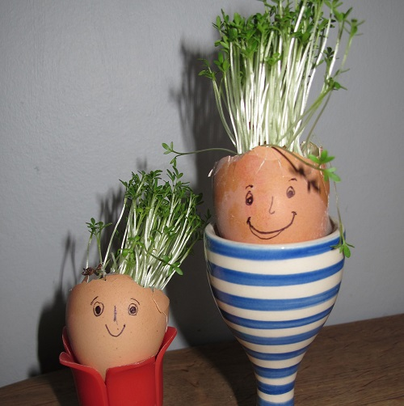

## Introduction

Explore time-lapse photography with a Raspberry Pi and the camera module.

Record a time-lapse film of some cress seeds growing over a period of one week.



--- collapse ---
---
title: What you will need
---
### Hardware

+ A Raspberry Pi Computer with the latest Raspberry Pi OS
+ A Raspberry Pi Camera module
+ An empty egg shell (ask an adult to boil and scrape out the egg for you)
+ Egg cup 
+ Cotton wool
+ Cress seeds

### Software

+ Run the following commands in a terminal to install the `picamzero` library

```bash
sudo apt update 
sudo apt install python3-picamera
```

--- /collapse ---


