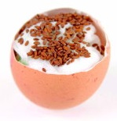

## Making a cress egg head

Plants grow far too slowly for you to see it happening. However, there's a trick that you can use to speed up time and watch them sprout!

If a photo is taken every minute, for instance, the photos can be stitched together into a movie or a GIF and the time between frames reduced to a fraction of a second. This is what we call a time-lapse film.

You're going to use the technique of time-lapse photography to watch cress growing on some egg heads. The only trouble is you need to let the time pass and capture the images along the way. This is where the Raspberry Pi comes in, but first you'll need to make some cress egg heads!

--- task ---

Begin by soft-boiling the egg in a saucepan: you should ask for some help from an adult. Boil for no more than three minutes. Remove the egg using the spoon and allow to cool before handling.

--- /task ---

--- task ---

Remove the top of the egg with the knife, as you would if you were going to eat it. Take care to avoid cracking the rest of the shell.

--- /task ---

--- task ---

Use the spoon to scoop out all of the cooked egg from the inside of the eggshell. Your aim is to have a completely empty shell; don't worry if you spill some yolk on the outside.

--- /task ---

--- task ---

Use the washing up liquid and bowl to wash the eggshell inside and out. Just use your fingers and handle the shell with care to avoid cracking it. Make sure there's no dried yolk on the outside.

Leave the egg to dry on some kitchen roll.

--- /task ---

--- task ---

Once the egg has dried, you can use the crayons and pencils to carefully decorate it. Remember that the hole will be facing upwards, so bear this in mind if you want to draw a face.

--- /task ---

--- task ---

Fill the eggs to the top with cotton wool and dampen with water. Top up with extra cotton wool and dampen again if necessary. The cotton wool should reach the top of the hole in the eggshell.

--- /task ---

--- task ---

Place the egg into an egg cup, then place the egg cup onto a plate.

Use your finger and thumb to sprinkle some cress seeds onto the cotton wool; the plate will catch any excess. That's it: the egg head is now ready to grow. Place the egg cup in a spot where it will receive sunlight during the day.

--- /task ---

