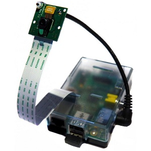

## Setting up the Camera Module

You can use the first two sections of the [Getting started with the camera module](https://projects.raspberrypi.org/en/projects/getting-started-with-picamera/) to test your camera and learn how to take a preview using Python.

--- task ---

It's a good idea to place your camera in a mount, to keep it still during the time-lapse shots. You could make your own, or use a commercial one like [this](http://www.modmypi.com/raspberry-pi/camera/camera-board-360-gooseneck-mount).

--- /task ---

--- task ---

With the camera in the mount, use the `preview` script from [Getting Started with the camera module](https://projects.raspberrypi.org/en/projects/getting-started-with-picamera/worksheet/) to test that the camera is pointing at the egg heads and has all of them in frame.

--- /task ---

